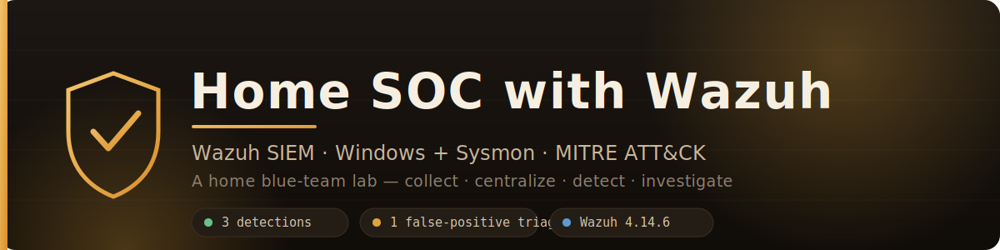
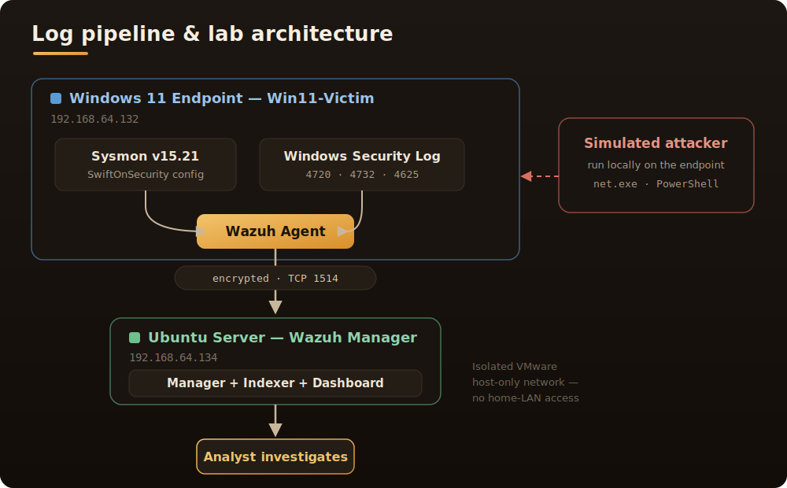
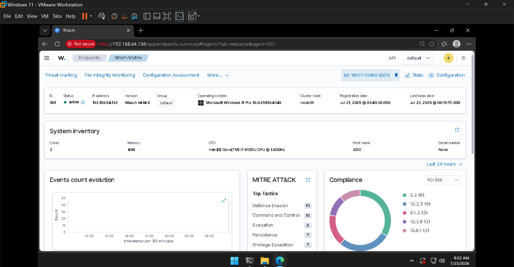
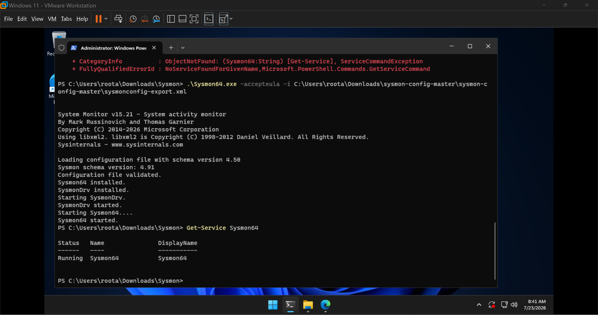
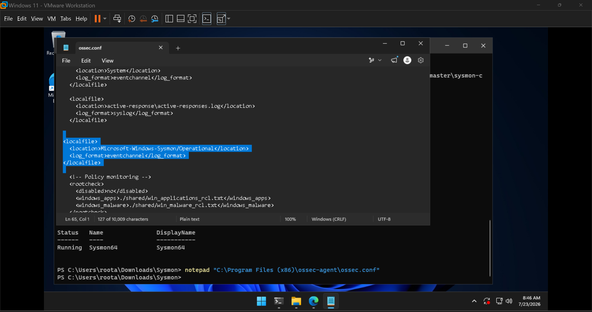
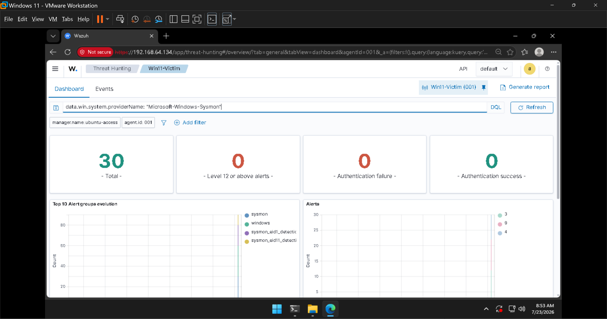
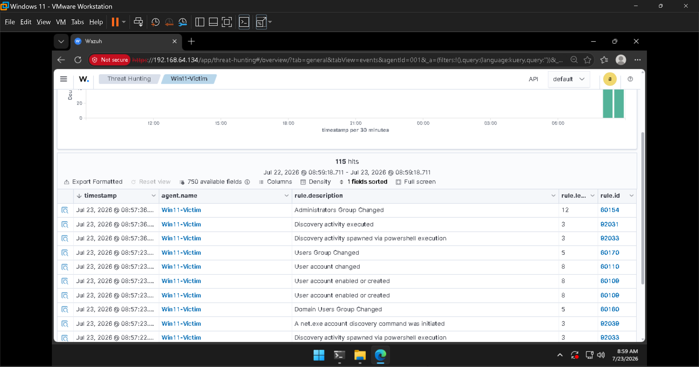

<div align="center">



<br><br>


**Collect logs from endpoints → centralize them in a SIEM → turn them into alerts → investigate like an analyst.**

</div>

---

## 📌 Overview

I deployed the **Wazuh** SIEM on an Ubuntu Server VM and onboarded a **Windows 11** endpoint,
enriching its telemetry with **Sysmon** (SwiftOnSecurity config). I then simulated three common
attacker behaviours on the endpoint and investigated the resulting alerts end-to-end — including
correctly triaging a scary-looking **level-15 alert down to a false positive**.

| | |
|---|---|
| **Role focus** | Junior SOC / Blue Team Analyst |
| **SIEM** | Wazuh 4.14.6 (Manager + Indexer + Dashboard) |
| **Endpoint** | Windows 11 Pro + Wazuh agent + Sysmon |
| **Detections demonstrated** | 3 (+ 1 false-positive triage) |
| **Frameworks** | MITRE ATT&CK, PCI DSS, NIST 800-53, HIPAA, GDPR |

---

## 🗺️ Architecture

<div align="center">
  
</div>

**Lab networking:** VMs run on an isolated VMware host-only network so the lab can't touch the
home LAN. The agent ships events to the manager over encrypted TCP/1514.

---

## 🔍 Detections demonstrated

| # | Attack simulated | MITRE technique | Key rule | Level | Write-up |
|---|------------------|-----------------|----------|:-----:|----------|
| 1 | Rogue local admin account created | [T1136 / T1098](https://attack.mitre.org/techniques/T1098/) — Account Manipulation | `60154` Administrators Group Changed | 🔴 **12** | [01](investigations/01-rogue-admin-account.md) |
| 2 | Brute-force / password spray | [T1110](https://attack.mitre.org/techniques/T1110/) — Brute Force | `60204` Multiple Windows Logon Failures | 🟠 **10** | [02](investigations/02-brute-force-logins.md) |
| 3 | Obfuscated (base64) PowerShell | [T1059.001](https://attack.mitre.org/techniques/T1059/001/) — PowerShell | `92027` PowerShell spawned PowerShell | 🟡 **4** | [03](investigations/03-obfuscated-powershell.md) |
| — | *(bonus)* Level-15 alert **triaged as false positive** | [T1105](https://attack.mitre.org/techniques/T1105/) — Ingress Tool Transfer | `92213` Executable dropped in malware folder | ⚪ FP | [03](investigations/03-obfuscated-powershell.md#false-positive-triage) |

Each write-up follows the analyst's 5 questions: **what fired → what actually happened → who/where → MITRE technique → what I'd do next.**

---

## 🖥️ The lab, built

**Wazuh agent onboarded and Active** — Windows 11 Pro endpoint reporting in, with the built-in
MITRE ATT&CK and compliance views populated:



**Sysmon installed** with the SwiftOnSecurity config (rich process/network/file telemetry):



**Wazuh agent told to forward the Sysmon channel** (`ossec.conf` localfile block):



**Sysmon events flowing into the SIEM** (filtered on the Sysmon provider):



---

## 🧪 How the detections were generated

All "attacker" activity was generated **locally on the Windows endpoint** — no separate attacker VM
needed. The exact commands are documented in [`config/attack-simulation.md`](config/attack-simulation.md).

A quick taste — Detection #1, a rogue admin account:

```powershell
net user hacker P@ssw0rd123! /add
net localgroup administrators hacker /add
```

...which immediately lit up a **level-12** alert chain in Wazuh:



Full step-by-step evidence for all three lives in the [investigations](investigations/).

---

## 📂 Repository structure

```
home-soc-wazuh/
├── README.md                       ← you are here
├── docs/
│   ├── banner.svg                  ← hero banner
│   ├── architecture.svg            ← architecture diagram
│   └── screenshots/                ← all evidence (14 images)
├── config/
│   ├── README.md                   ← config notes
│   ├── sysmon-localfile.xml        ← the ossec.conf snippet used
│   └── attack-simulation.md        ← exact commands used to generate each alert
└── investigations/
    ├── 01-rogue-admin-account.md
    ├── 02-brute-force-logins.md
    └── 03-obfuscated-powershell.md
```

---

## 🎓 What I learned

- **A SIEM is a correlation engine, not a log viewer.** The single most valuable moment was watching
  Wazuh turn 12 individual failed logins (level 5) into *one* "brute force" alert (level 10) — that's
  detection engineering in action.
- **Context beats severity.** A level-15 "executable dropped in a malware folder" alert turned out to
  be a benign PowerShell temp file. Triaging it down using the event evidence is the real day-job.
- **Telemetry quality matters.** Default Windows logs are useful; adding Sysmon made process lineage
  (parent/child) and file-create events visible, which is what modern detections rely on.
- **MITRE ATT&CK gives every alert a shared language** — being able to say "this is T1110" makes an
  investigation communicable to the rest of a team.

## 🚀 What I'd improve next

- Add a **second (Linux) endpoint** with `auditd` for cross-platform coverage.
- Integrate a **threat-intel feed** (e.g. AbuseIPDB) to auto-enrich suspicious IPs.
- Wire the detections into **Atomic Red Team** to test them against a broader technique set.
- Add **automated alert triage** (SOAR) — enrich and score alerts with a Python script.

---

*Built as a portfolio project for junior SOC analyst roles. Part of a five-project SOC series.*
