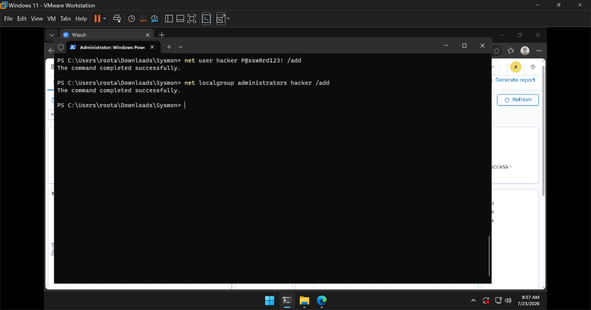
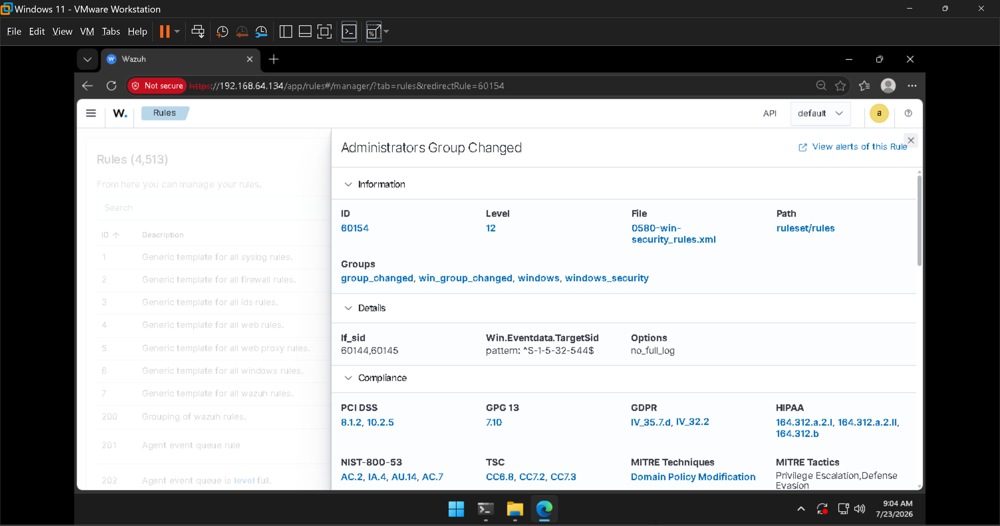
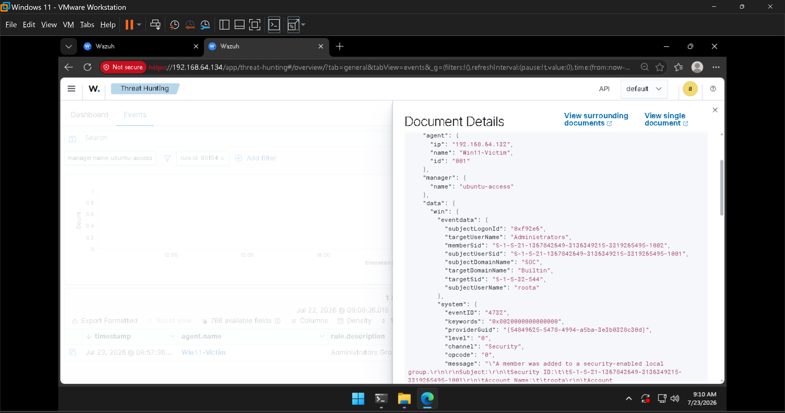

# Investigation 01 — Rogue Local Administrator Account

**Alert:** `Administrators Group Changed` · **Rule ID:** `60154` · **Severity level:** 🔴 12
**MITRE ATT&CK:** [T1136 – Create Account](https://attack.mitre.org/techniques/T1136/) · [T1098 – Account Manipulation](https://attack.mitre.org/techniques/T1098/)
**Tactics:** Persistence · Privilege Escalation

---

## Scenario

An attacker who has landed on a host will often create a new local user and add it to the
**Administrators** group — a quiet, reliable way to keep privileged access even if their initial
foothold is closed. I simulated exactly that on the Windows endpoint.

### Activity generated

Run on `Win11-Victim` in an elevated PowerShell:

```powershell
net user hacker P@ssw0rd123! /add
net localgroup administrators hacker /add
```



---

## What fired

A single pair of commands produced a whole **chain of alerts** — this is what makes the SIEM valuable:


| rule.id | Description | Level | Meaning |
|---------|-------------|:-----:|---------|
| **60154** | **Administrators Group Changed** | **12** | 🚨 A member was added to the local Administrators group |
| 60109 | User account enabled or created | 8 | Event 4720 — the account was created |
| 60110 | User account changed | 8 | Account properties were set |
| 60170 | Users Group Changed | 5 | Membership change |
| 92039 | A net.exe account discovery command was initiated | 3 | Wazuh even caught the use of `net.exe` |
| 92031 / 92033 | Discovery activity via PowerShell | 3 | The command ran under PowerShell |

The **"Level 12 or above alerts"** counter on the dashboard lit up — in a real SOC, level 12+ is the
tier that pages an analyst.

---

## The detection logic (rule 60154)

Opening the rule shows *why* it fires and how it's classified:



- **Condition:** `Win.Eventdata.TargetSid` matches `^S-1-5-32-544$` — the **universal SID of the
  built-in Administrators group**. That's what scopes this rule to *admin* group changes specifically.
- **MITRE:** Domain Policy Modification → Privilege Escalation, Defense Evasion.
- **Compliance:** PCI DSS 8.1.2 / 10.2.5, NIST 800-53 AC.2 / IA.4, HIPAA, GDPR.

---

## The evidence (event 4732)

Expanding the actual alert instance gives the *who / what / when*:



| Field | Value | Interpretation |
|-------|-------|----------------|
| `system.eventID` | **4732** | "A member was added to a security-enabled local group" |
| `targetUserName` | **Administrators** | The group that was modified |
| `targetSid` | **S-1-5-32-544** | Confirms the built-in Admins group |
| `subjectUserName` | **roota** | 👈 the actor who performed the change |
| `memberSid` | **S-1-5-21-…-1002** | The SID of the account that was added (`hacker`) |
| `agent.name` / `agent.ip` | **Win11-Victim / 192.168.64.132** | The affected host |

---

## Analyst summary

> On **Win11-Victim**, user **`roota`** created a new local account and added it to the built-in
> **Administrators** group (Event 4732, rule `60154`, level 12). This is consistent with
> **MITRE T1136 / T1098** — creating a privileged backdoor account for persistence.

## What I'd do next (in a real incident)

1. **Contain** — disable the `hacker` account immediately (`net user hacker /active:no`).
2. **Scope** — check whether the account was used to log in anywhere (`4624` events for that SID).
3. **Root cause** — determine how `roota` was able to run this: legitimate admin, or a compromised
   session? Hunt for the initial access.
4. **Eradicate** — remove the account and confirm no scheduled tasks/services were created under it.
5. **Lessons** — alert on *any* addition to privileged groups; review who holds local admin.

## Cleanup (lab)

```powershell
net localgroup administrators hacker /delete
net user hacker /delete
```
