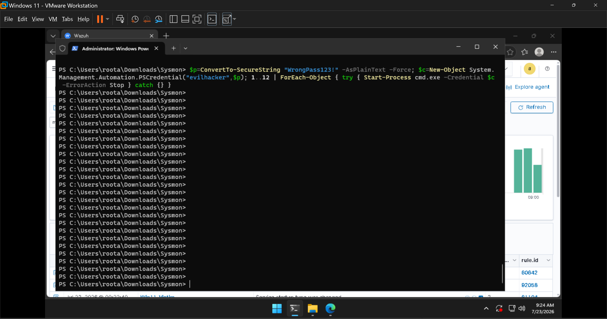
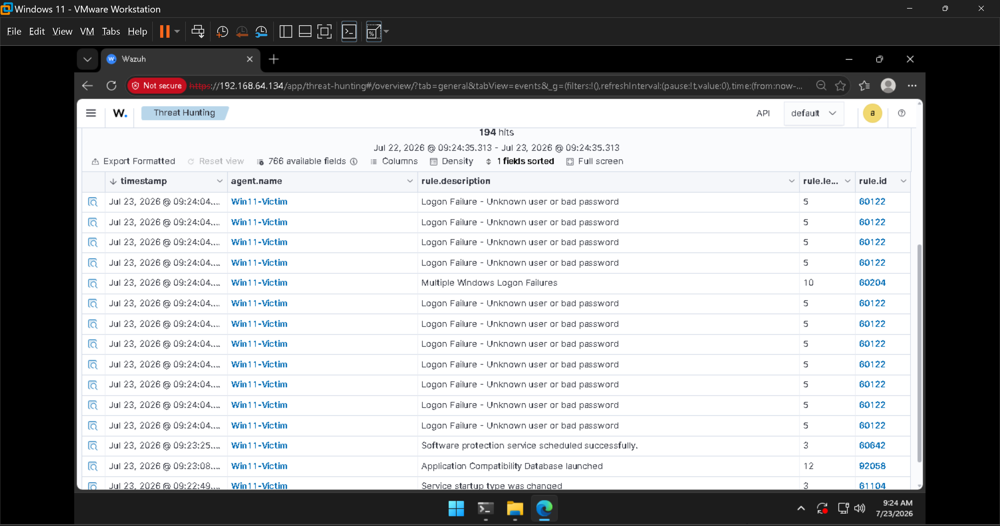
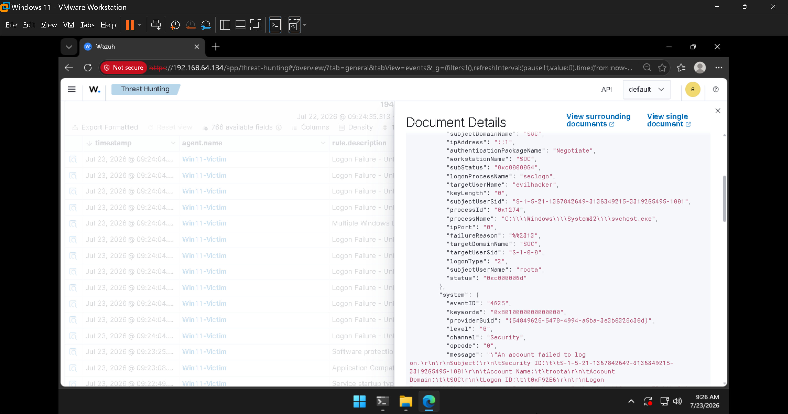

# Investigation 02 — Brute-Force / Password-Spray Logins

**Alert:** `Multiple Windows Logon Failures` · **Rule ID:** `60204` · **Severity level:** 🟠 10
**MITRE ATT&CK:** [T1110 – Brute Force](https://attack.mitre.org/techniques/T1110/)
**Tactic:** Credential Access

---

## Scenario

An attacker guessing passwords generates a burst of failed logons in a short window. Individually
each failure is unremarkable — people mistype passwords all the time — but the **pattern** is the
signal. I simulated a burst of failed logons for a non-existent user.

### Activity generated

Run on `Win11-Victim` in an elevated PowerShell (a **fake** username is used so no real account gets
locked out):

```powershell
$p = ConvertTo-SecureString "WrongPass123!" -AsPlainText -Force
$c = New-Object System.Management.Automation.PSCredential("evilhacker",$p)
1..12 | ForEach-Object { try { Start-Process cmd.exe -Credential $c -ErrorAction Stop } catch {} }
```



This attempts to start a process as `evilhacker` with a wrong password 12 times; every attempt fails
and Windows logs **Event 4625**.

---

## What fired — and why this is the important one



| rule.id | Description | Level | Meaning |
|---------|-------------|:-----:|---------|
| 60122 (×12) | Logon Failure – Unknown user or bad password | 5 | Each individual failed logon (Event 4625) |
| **60204** | **Multiple Windows Logon Failures** | **10** | 🚨 The **correlated** brute-force pattern |

**This is the heart of SIEM value.** Wazuh didn't just log twelve level-5 failures — it *correlated*
them into a single, higher-severity **level-10** alert that says "this cluster of failures is a
brute-force attempt, not a typo." Turning many low-signal events into one high-signal detection is
exactly what **detection engineering** means.

---

## The evidence (event 4625)

Expanding one of the failures shows the textbook brute-force signature:



| Field | Value | Interpretation |
|-------|-------|----------------|
| `system.eventID` | **4625** | "An account failed to log on" |
| `targetUserName` | **evilhacker** | The account being guessed |
| `subStatus` | **0xC0000064** | *"user name does not exist"* — classic account-spray indicator |
| `status` | **0xC000006D** | Logon failure |
| `logonType` | **2** | Interactive logon attempt |
| `logonProcessName` | **seclogo** | seclogon — matches how the attempt was generated |
| `ipAddress` | **::1** | Localhost (our simulated attacker) |
| `subjectUserName` | **roota** | The context the attempts ran under |

The `subStatus 0xC0000064` ("user does not exist") is a strong tell: a real user fat-fingering a
password produces *bad password* (`0xC000006A`), whereas hammering usernames that don't exist is what
**password spraying / account enumeration** looks like.

---

## Analyst summary

> **Win11-Victim** recorded **12 failed logons in seconds** for a non-existent user (`evilhacker`),
> which Wazuh correlated into a single brute-force alert (rule `60204`, level 10). The `0xC0000064`
> sub-status indicates username spraying — **MITRE T1110, Credential Access.**

## What I'd do next (in a real incident)

1. **Identify the source** — here it's `::1` (local), but in a real event I'd pivot on `ipAddress` to
   see if it's internal or external, and whether other hosts saw the same source.
2. **Check for success** — did any `4624` (successful logon) follow the burst from the same source?
   A failure burst *followed by a success* is a likely compromise.
3. **Contain** — block the source IP; if a real account was targeted, force a password reset and
   enable/verify account lockout policy.
4. **Harden** — enforce lockout thresholds, MFA where possible, and alert on failure bursts per source.

## Note on lab safety

A **fake** username (`evilhacker`) was deliberately used instead of a real account, so the lab's own
login could never be locked out by the simulation.
