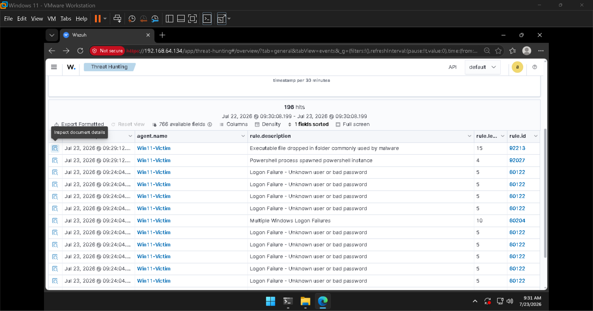
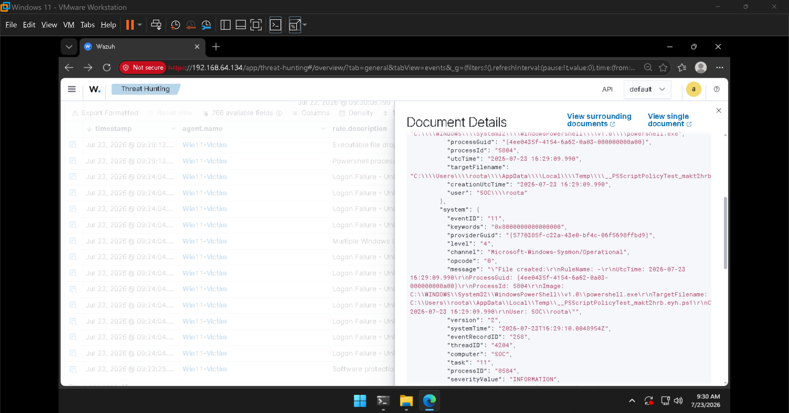
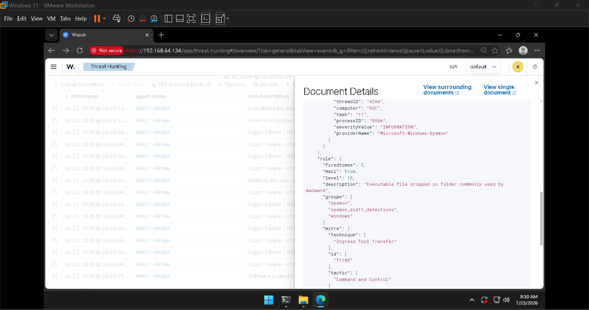

# Investigation 03 — Obfuscated PowerShell (+ a False-Positive Triage)

**Alert:** `Powershell process spawned powershell instance` · **Rule ID:** `92027` · **Level:** 🟡 4
**MITRE ATT&CK:** [T1059.001 – PowerShell](https://attack.mitre.org/techniques/T1059/001/)
**Tactic:** Execution

This investigation has **two parts**: the intended detection (obfuscated PowerShell), and a **bonus
false-positive triage** of a scary-looking level-15 alert — the more valuable analyst lesson.

---

## Scenario

Malware frequently runs PowerShell with a **base64-encoded command** and flags that hide the window
and skip the user profile (`-nop -w hidden -enc`). This exercises the **Sysmon** side of the pipeline
(process creation and lineage), not just the Windows Security log.

### Activity generated

Run on `Win11-Victim` in an elevated PowerShell:

```powershell
$cmd = 'Write-Host "simulated suspicious command"'
$enc = [Convert]::ToBase64String([Text.Encoding]::Unicode.GetBytes($cmd))
powershell.exe -nop -w hidden -enc $enc
```

---

## What fired



| rule.id | Description | Level | Meaning |
|---------|-------------|:-----:|---------|
| **92027** | **PowerShell process spawned PowerShell instance** | **4** | ✅ The true positive — our `-enc` child process |
| 92213 | Executable file dropped in folder commonly used by malware | **15** | ⚠️ **Actually a false positive** (see below) |

The encoded one-liner caused `powershell.exe` to spawn *another* `powershell.exe` (the `-enc` child).
Wazuh flagged that parent→child lineage — a classic obfuscation/execution pattern (**T1059.001**).

---

## False-positive triage

> *This is the real analyst skill on display.*

The **level-15** "Executable file dropped in folder commonly used by malware" looks like the worst
alert of the day. A junior analyst who escalates on severity alone would raise a false alarm. Reading
the evidence tells a different story.

**Event detail — Sysmon Event ID 11 (File Create):**



**Rule metadata — level 15, MITRE T1105:**



| Field | Value | Interpretation |
|-------|-------|----------------|
| `system.eventID` | **11** | Sysmon "File Create" |
| `data.win.eventdata.image` | **…\WindowsPowerShell\v1.0\powershell.exe** | PowerShell wrote the file |
| `data.win.eventdata.targetFilename` | `…\AppData\Local\Temp\__PSScriptPolicyTest_makt2hrb.eyh.ps1` | The "dropped executable" |
| `rule.level` | **15** | Fired because a file landed in **Temp** (a folder malware favours) |
| `rule.mitre.id` | **T1105** – Ingress Tool Transfer | Command and Control |

### Verdict: **benign / false positive**

That `__PSScriptPolicyTest…ps1` file is a **temporary file PowerShell writes every time it checks its
execution policy.** The rule fired purely because *a file was created in the Temp directory* — but the
**context** (author is `powershell.exe`, the filename is PowerShell's own policy-test artifact, and it
correlates in time with our benign encoded command) proves it is **not** malware.

> **Triaging a high-severity alert down to benign using event context is the core day-job of a SOC
> analyst** — and it demonstrates judgment, not just tool operation.

---

## Analyst summary

> An obfuscated, base64-encoded PowerShell command executed on **Win11-Victim**, detected via
> parent→child PowerShell lineage (rule `92027`, **T1059.001**). A simultaneous **level-15** alert
> (`92213`, "executable dropped in malware folder") was investigated and **determined to be a false
> positive** — a benign `__PSScriptPolicyTest` temp file that PowerShell creates during normal
> operation.

## What I'd do next (in a real incident)

1. **For the true positive** — decode the base64 (`-enc`) payload to see what actually ran; here it
   was benign, but in a real case the decoded command is the crux of the investigation.
2. **Pivot on process lineage** — what launched the parent PowerShell? Office macro? Scheduled task?
3. **For the false positive** — document the triage reasoning and consider a tuning exception so the
   `__PSScriptPolicyTest` artifact doesn't generate level-15 noise in future.
4. **Tune, don't ignore** — reducing false positives keeps analysts focused on real threats.
